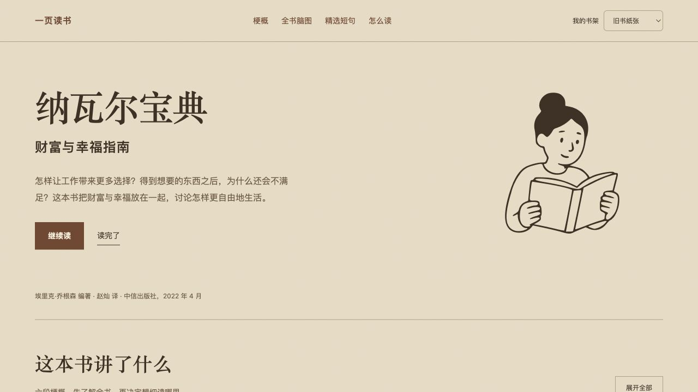
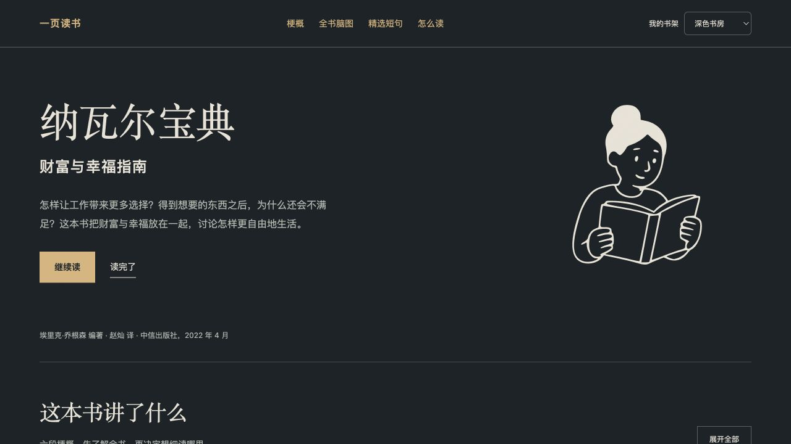
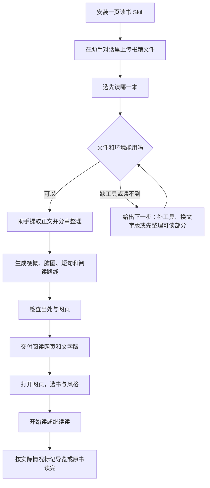

# bela-One-page-book · 一页读书

想读一本厚书，又不知道从哪里开始？可以先看看它讲了什么，再挑你感兴趣的章节读下去。

一页读书会把你提供的书整理成一个能点开看的网页：有梗概、全书脑图、少量有出处的短句，也有回到原书的阅读路线。

> 欢迎来到一页读书。这是留给你的一点时间，不必急着读完。

**第一次用，按下面的“安装 → 上传 → 生成 → 打开”走就可以。** 现在是 0.1 试用版，生成需要支持 Skill、文件读取和程序运行的 AI 助手；生成好的网页可以单独打开。

[开始安装](INSTALL.md) · [看截图](docs/screenshots.md) · [详细使用方法](docs/usage.md) · [测试结果](TESTING.md)

## 它会帮你整理什么

| 你想看什么 | 网页里有什么 |
|---|---|
| 先知道这本书讲什么 | 按问题或故事脉络整理的梗概 |
| 弄清各章有什么关系 | 可以展开的脑图，以及手绘风格的结构图 |
| 留下值得回看的句子 | 短摘录、语境和出处；没有可靠原文就不硬凑 |
| 想接着读原书 | 推荐从哪里读、为什么值得读 |
| 一次整理了好几本 | 页面顶部选书，各书分别记阅读状态 |

小说和传记会围绕人物、经历与转折整理，知识类会侧重观点和论证。只提供部分章节时，结果会说明范围，不会把它写成全书总结。

## 五种风格，读的时候随时换

页面顶部有“风格”菜单。换风格会改变配色，书籍内容和阅读记录不变。

| 风格 | 大概是什么感觉 | 配色 |
|---|---|---|
| 马蒂斯 | 活泼，重点比较醒目 | 奶油纸色、蓝色，辅以粉色和黄色 |
| 莫兰迪 | 柔和，颜色比较收敛 | 灰米色、灰绿色、淡玫瑰色 |
| 旧书纸张 | 像翻开一本放了一阵子的旧书 | 暖纸色、棕色 |
| 瑞士极简 | 清楚、利落 | 米白、黑色、红色 |
| 夜读 | 深色背景 | 深灰蓝、暖白字、暖金色重点 |

默认是莫兰迪。你也可以在生成时说：“我想先用旧书纸张的风格。”

当前分享版使用同一套响应式版式切换五组主题颜色，并自带手绘结构框。人物插画和更复杂的拼贴属于可选增强，不需要先装插画 Skill 才能使用。

### 五种风格实际截图

下面是当前本地原型同一页面的五主题截图，均为 1280 × 720，方便比较颜色和文字观感。**截图含原型人物插画，便携分享版不保证同样布局和插画。**

<table>
<tr>
<td><strong>马蒂斯</strong> </td>
<td><strong>莫兰迪</strong> </td>
</tr>
<tr>
<td><strong>旧书纸张</strong> </td>
<td><strong>瑞士极简</strong> </td>
</tr>
<tr>
<td><strong>夜读／深色书房</strong> </td>
</tr>
</table>

点击图片可看大图。[全部截图与版本说明](docs/screenshots.md)

## 第一次怎么用

### 1. 安装整个文件夹

在仓库顶部点 **Code → Download ZIP**，解压。把解压后的文件夹改名为 `bela-one-page-book`，再放到助手的 Skill 目录。

要保留里面的 `SKILL.md`、`scripts`、`assets` 等文件，不能只复制一份 MD。具体放哪里、怎么检查装好没有，见 [安装说明](INSTALL.md)。

### 2. 把书上传到助手对话里

在支持附件的助手中添加书籍文件；使用本地文件型助手时，也可以直接提供它能访问的文件路径。然后把下面这句话发给它：

> 使用 $bela-one-page-book，帮我把这本书做成一页读书。先让我知道它讲了什么，再整理脑图、值得回看的短句和阅读路线，最后给我一个能打开的网页。

**书籍上传到你正在使用的 AI 助手，不是上传到 GitHub，也不是上传到生成好的阅读网页。** 文件转换由助手处理，你不用自己先弄成 Markdown。

| 文件 | 怎么处理 |
|---|---|
| PDF | 能提取文字的版本可以处理；扫描版需要额外文字识别 |
| EPUB | 按书内章节顺序提取；加密、图片文字等情况可能需要换版本 |
| TXT / MD / Markdown | 可以直接整理 |
| MOBI | 先由 Calibre 转换；没有工具时会告诉你如何补齐，或改用 EPUB |

图片里的字不会因为文件是 PDF/EPUB 就自动变成文字。助手发现读不到的页面时，应说明缺口。MOBI 的真实书籍转换仍待补充实测。

### 3. 等助手整理，再打开结果

助手会检查文件，把可读内容转成工作材料，分段阅读，再整理梗概与出处。长书需要更多处理时间，不保证固定几分钟完成。

完成后会给你：

- `index.html`：阅读网页，双击或用浏览器打开。
- `guide.md`：文字版导览，可单独保存。
- `books.json`：已经整理好的网页内容。以后合并多本书时保留它，不用自己编辑。

用 Chrome、Edge 或 Safari 正常打开 HTML 即可开始查看；不同浏览器的显示仍在补充验收。看成品不需要安装 Skill，也不需要再运行生成模型。

### 4. 按兴趣读，不用从头读到底

点“开始读”，可以展开梗概、查看脑图，或直接找阅读路线。点“查看出处”，会显示对应的页序或章节位置和一小段上下文；要看完整章节，回到原书阅读器打开原书。

读过以后按钮会变成“继续读”，可以回到记录的展开栏目。看完导览时，点“导览读完了”；完整原书也读完时，再点“原书读完了”。两种记录分别计算。

## 一次想放很多本书，可以吗

可以一次把多本文件交给助手，先告诉它从哪本开始：

> 使用 $bela-one-page-book。这几本书都帮我整理，先做《书名》。完成后把它们合并到一个能选书的网页里，每本保留自己的梗概、脑图、短句和阅读路线。

每本书需要分别阅读和生成，不是上传一次就立刻全部完成。某本暂时读不了，可以保留原因，继续处理其他能读的书。

以后要加新书，把新书和之前保存的输出文件夹一起交给助手：

> 把这本新书加入我已有的一页读书页面。旧书的导览保留，生成一个包含全部书的选书页面。

最好保留各书的整个输出文件夹，尤其是 `books.json`。只留一张截图或一个书名，不能恢复之前整理的全部内容。换成新网页前，可以先导出阅读记录作为备份。

## 从上传到阅读的流程

想看“每一步用了什么能力”，见 [能力流程图](references/workflow.md)。

## 截图怎么看

下面是我们先前本地书架原型的实际截图，帮助理解“选书”和“展开脑图”的阅读方式。**它们不是当前便携 Skill 模板的截图。** 图中的“批量添加 PDF”、原书翻页和人物插画，并未全部随 0.1 分享包提供；当前版的导入方法以上面的对话上传步骤为准。

  
  

[截图逐项说明与版本区别](docs/screenshots.md)

## 阅读记录需要每天保存吗

不用。页面会尝试在当前浏览器自动保存。

“导出阅读记录”是备份，“导入阅读记录”是恢复或合并备份。换浏览器、换电脑或更换网页文件前，导出一份会更稳妥。浏览器清理数据、无痕模式以及文件位置变化，都可能影响记录保留；它不会自动同步到另一台设备。

记录备份不包含原书，也不包含导览正文，所以原书和生成的输出文件夹也要保留。更完整的说明见 [保存与备份](docs/usage.md#保存与备份)。

## 遇到问题，直接这样说

| 现在卡在哪里 | 可以告诉助手 |
|---|---|
| 没认出 Skill | “请检查一页读书是否安装完整，路径是否正确。” |
| 没有 Python 或不能运行工具 | “先检查可用环境。能先给我文字版就先整理，并说明网页还缺哪一步。” |
| PDF 提取不到字 | “帮我判断是不是扫描版，说明哪些页读不到。” |
| MOBI 打不开 | “检查有没有 Calibre；暂时不能转的话，我换 EPUB。” |
| 书太长，中途停了 | “接着处理这本书，先确认上次已经读到哪里。” |
| 没有其他设计 Skill | 不必一次装齐，一页读书自带基础文字规则、五主题和手绘结构图 |
| 没有可用模型或额度 | 先保留已处理材料，恢复后继续；转换文件本身不会自动产生梗概 |

## 当前测试到哪了

Windows、Linux、macOS 的基础自动检查已通过，包含环境检测、转换相关测试、记录逻辑和示例网页生成。[查看运行记录](https://github.com/belalee-ai/bela-One-page-book/actions/runs/35559536928)

当前便携模板的浏览器视觉验收、真实 MOBI 和真实厚书完整流程仍待补充。原型截图不能代替这些检查。[测试状态](TESTING.md) 里会保留具体范围。

书籍由你选择的助手处理，遵循该助手的数据规则；成品网页本身没有上传正文或调用模型的代码。分享这个 Skill 不需要附上你的私人书籍、阅读记录或账号信息。

## 声明与致谢

做一页读书的过程中，我调用和参考了其他创作者分享的 Skill，也借鉴了现成工具和素材。这个项目是我围绕“厚书读不完，怎么先看懂、再继续读”这个需求，把这些能力放到一起，反复试用和调整后整理出来的。

感谢这些项目和背后的创作者：

- [Hallmark](https://github.com/nutlope/hallmark)：帮助我调整文字层级与页面排版。
- [Apple Design（emilkowalski/skills）](https://github.com/emilkowalski/skills)：用于思考和检查界面的动效、连续性与减少动态效果。
- [Humanizer-zh](https://github.com/op7418/humanizer-zh)：帮助我把说明写得更自然，也感谢它所借鉴的 Humanizer 等上游项目。
- **Design Taste、Product Design Audit 和 skill-creator**：分别用于版面判断、界面检查，以及 Skill 的整理和封装。这里保留实际使用的名称；没有核实到公开来源的本地版本，暂不标注具体作者或猜测链接。
- [Koboyo Icons](https://koboyo.com/icons)：本地原型使用了其中的阅读人物素材，截图中的相关图形来自这里。

设计过程中，我也参考了 [AntV Infographic](https://github.com/antvis/Infographic) 的信息图思路，以及 [Ian Xiaohei Illustrations](https://github.com/helloianneo/ian-xiaohei-illustrations) 的手绘插画方法。它们在这里属于参考来源，不表示当前分享包已经接入了这些项目的全部功能。

这些致谢记录的是制作过程中的帮助，不代表每次生成都会自动调用所有外部 Skill。相关 Skill 和素材的权利仍归原作者，使用时应遵守各自的许可；本项目的整理、改动和说明由我负责。谢谢愿意把方法和作品分享出来的人，也希望这份整理能帮你更轻松地开始读一本书。
