# 看图理解阅读方式

## 0.2：PDF 标注实际示例

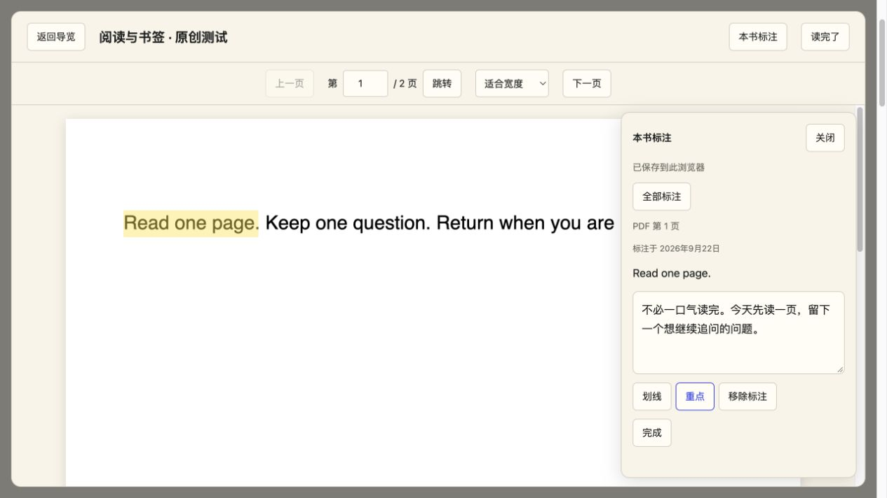

2026-09-22，macOS 内置 Chromium，0.2 便携版实际操作。使用随包原创 PDF 和公开演示笔记，展示原文高亮、笔记编辑、首次标注日期和已保存状态。[按步骤试用](pdf-annotations.md)。

## 先前原型的风格展示

本页截图来自 2026-09-21 的本地书架原型。它们是真实界面截图，用于展示我们探索过的阅读方式，**不是当前 0.1 便携 Skill 模板的截图**。

分享版按 [使用教程](usage.md) 操作：书籍交给助手，生成后在网页顶部选书。便携模板的新截图仍待补充，不能用下面的原型截图代替它的视觉验收。

## 五种风格对比

每种三张，共 15 张，分别展示首屏、问题脑图和八句话。均为 1280 × 720；各主题使用同一部分内容，方便比较。图中“深色书房”对应分享版里的“夜读”。

### 马蒂斯

蓝、黄、粉色短句卡片与彩色主题标签。

**首屏**

**从感兴趣的问题读起**

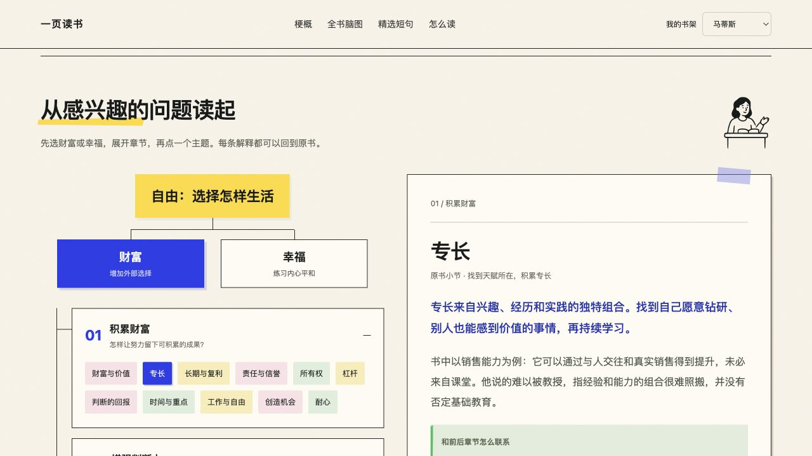

**值得回看的八句话**

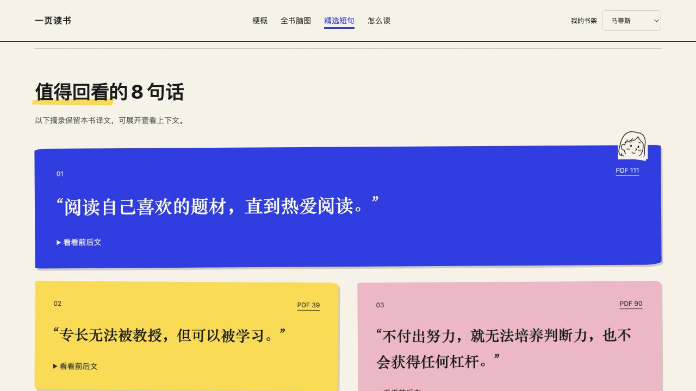

### 莫兰迪

灰绿与灰粉的柔和卡片。

**首屏**

**从感兴趣的问题读起**

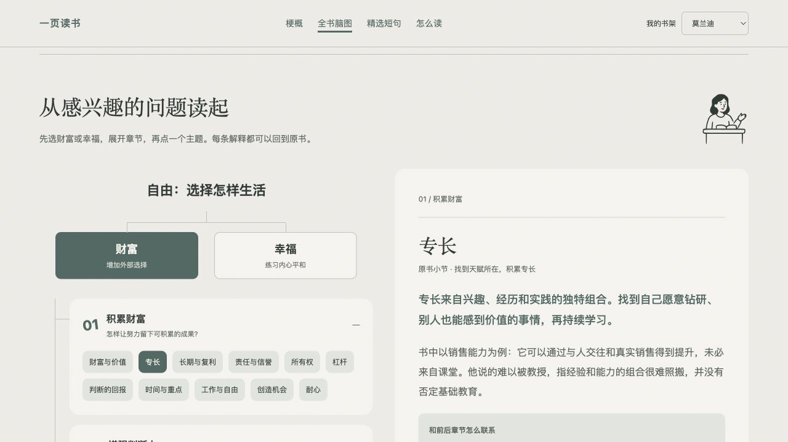

**值得回看的八句话**

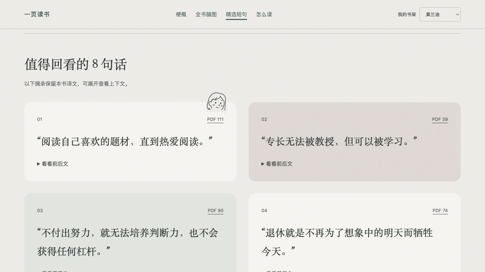

### 旧书纸张

暖色纸张、棕色正文与双线边框。

**首屏**

**从感兴趣的问题读起**

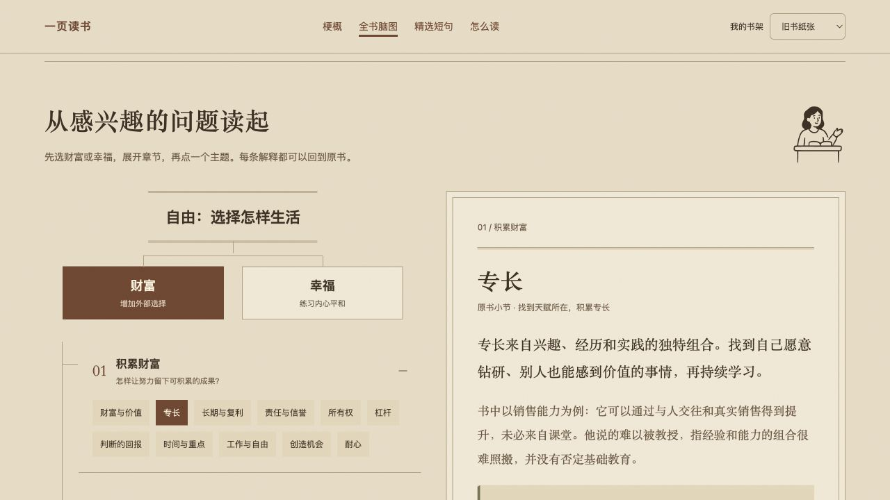

**值得回看的八句话**

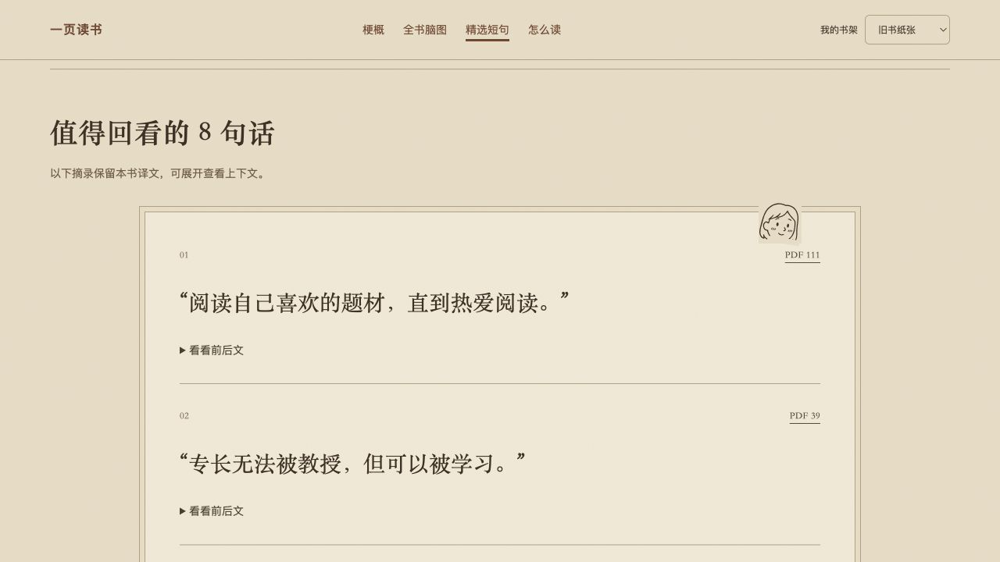

### 瑞士极简

红色重点、清楚的黑字与分隔线。

**首屏**

**从感兴趣的问题读起**

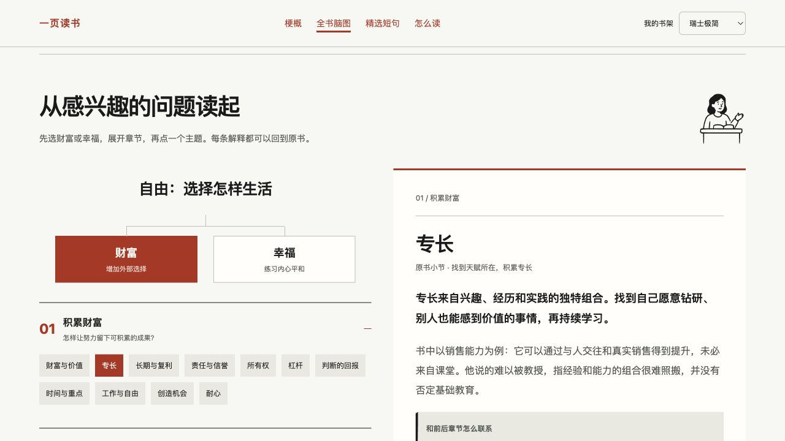

**值得回看的八句话**

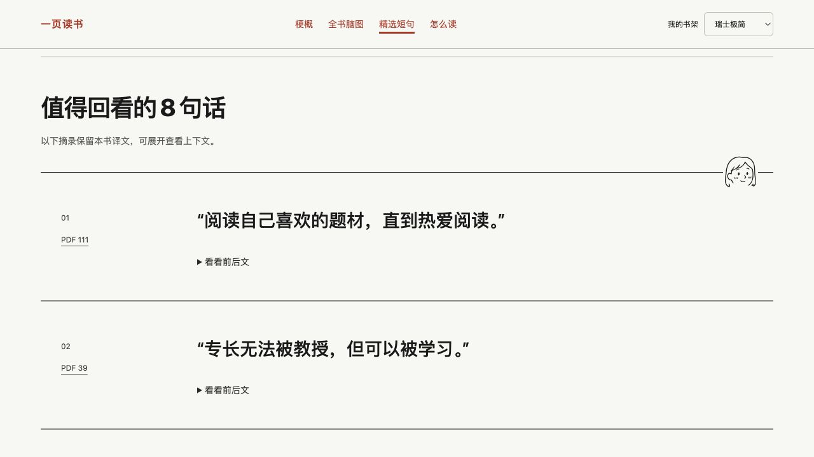

### 夜读／深色书房

深色卡片、暖白正文和暖金色重点。

**首屏**

**从感兴趣的问题读起**

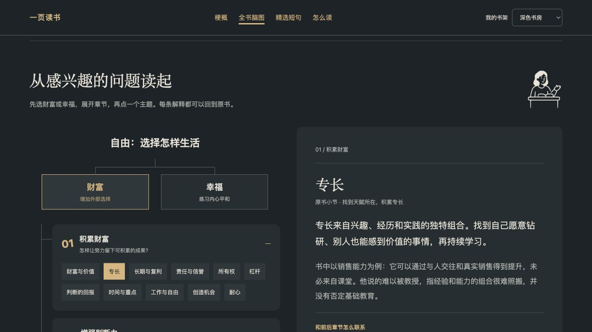

**值得回看的八句话**

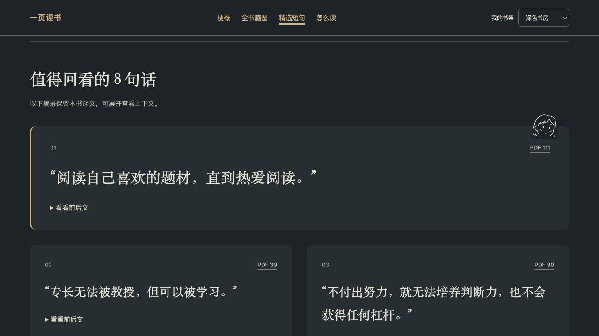

## 书架与阅读状态

图中把“导览读完”和“原书读完”分开统计。读完梗概并不意味着读完了整本书；这个区分保留到了分享版。

图里的“批量添加 PDF”是原型本地服务的功能。当前分享版要在助手对话里提供文件，生成后通过顶部菜单选书，并没有这个上传弹窗。原型的“继续读原书”也不等于分享版的“继续读导览”。

## 展开脑图，回到出处

图中先显示一个问题，展开后看到子主题、解释和出处。分享版保留“展开后读解释、查看来源位置”的方式，具体结构和按钮样式以生成结果为准。

原型可以把链接交给本地原书阅读器；分享版的出处按钮显示位置和短上下文，完整原书需用自己的阅读器打开。

## 截图和素材来源

- 截图由本项目在本地原型的设计检查中取得；没有将其包装成新模板测试结果。
- 原型中的阅读人物使用 [Koboyo Icons](https://koboyo.com/icons)，许可见 [Koboyo 许可页](https://koboyo.com/icons/license)。这里作为产品截图展示，不提供单独图标下载。
- 当前分享包未包含该人物素材库。基础手绘结构图由网页模板绘制，五主题由随包配色实现。
