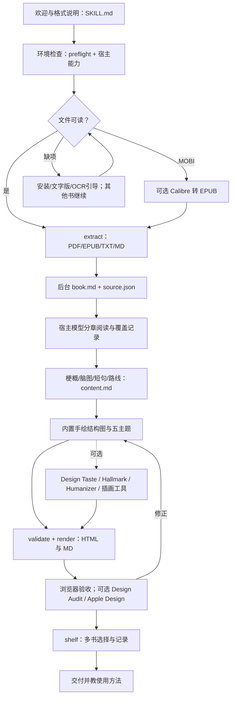

# 流程与能力

```mermaid
flowchart TD
 A[欢迎与格式说明：SKILL.md] --> B[环境检查：preflight + 宿主能力]
 B --> C{文件可读？}
 C -->|是| D[extract：PDF/EPUB/TXT/MD]
 C -->|MOBI| E[可选 Calibre 转 EPUB]
 C -->|缺项| F[安装/文字版/OCR引导；其他书继续]
 E --> D
 F --> C
 D --> G[后台 book.md + source.json]
 G --> H[宿主模型分章阅读与覆盖记录]
 H --> I[梗概/脑图/短句/路线：content.md]
 I --> J[内置手绘结构图与五主题]
 J -.可选.-> K[Design Taste / Hallmark / Humanizer / 插画工具]
 J --> L[validate + render：HTML 与 MD]
 K --> L
 L --> M[浏览器验收；可选 Design Audit / Apple Design]
 M -->|修正| J
 M --> N[shelf：多书选择与记录]
 N --> O[交付并教使用方法]
```

无模型保留材料；无OCR标记缺页；无浏览器标记未可视验收；无执行能力先交付MD。生成需要有能力的宿主，看成品只需现代浏览器。
